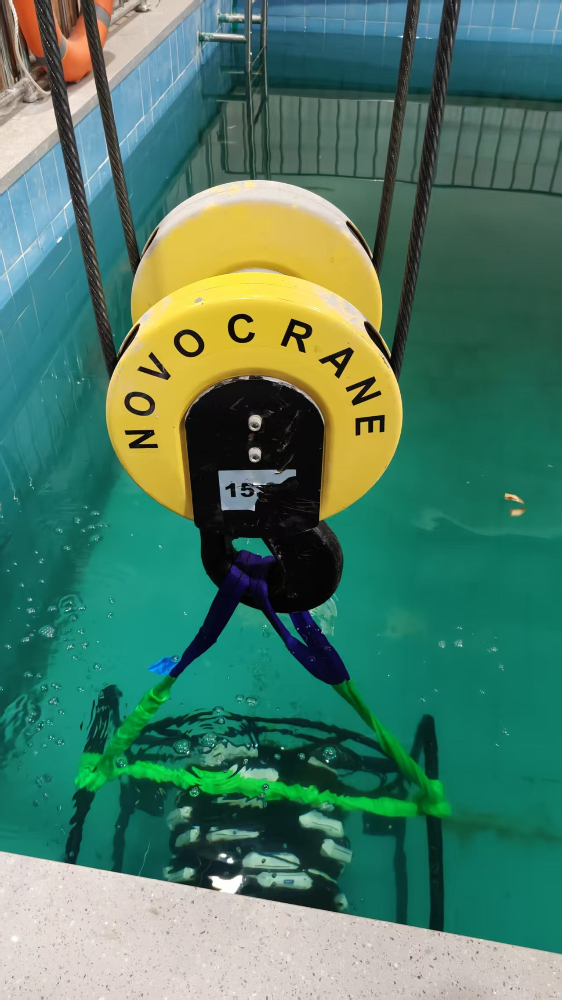
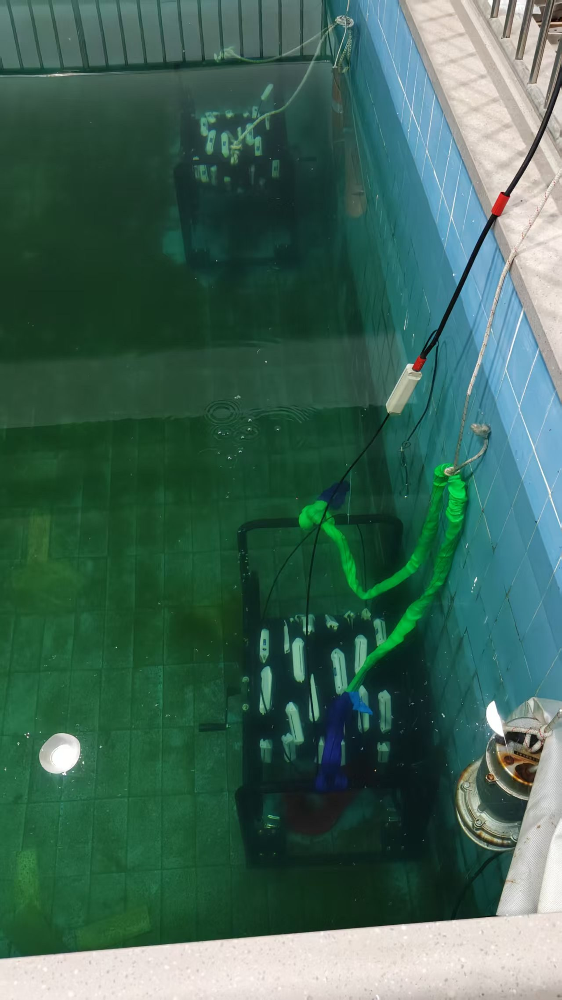
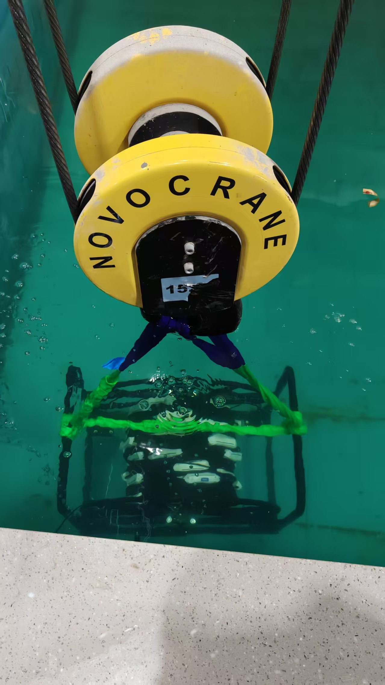
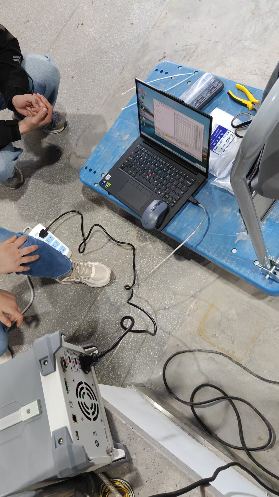
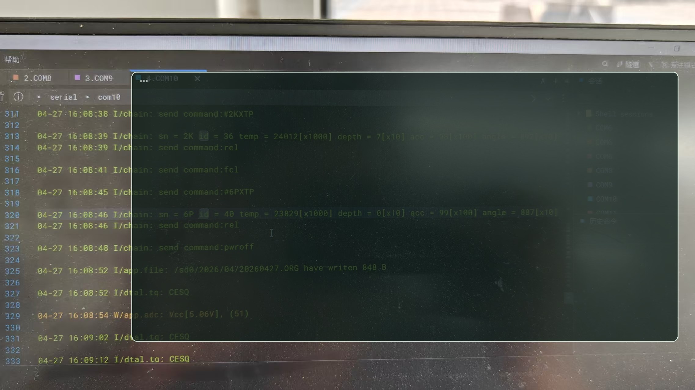
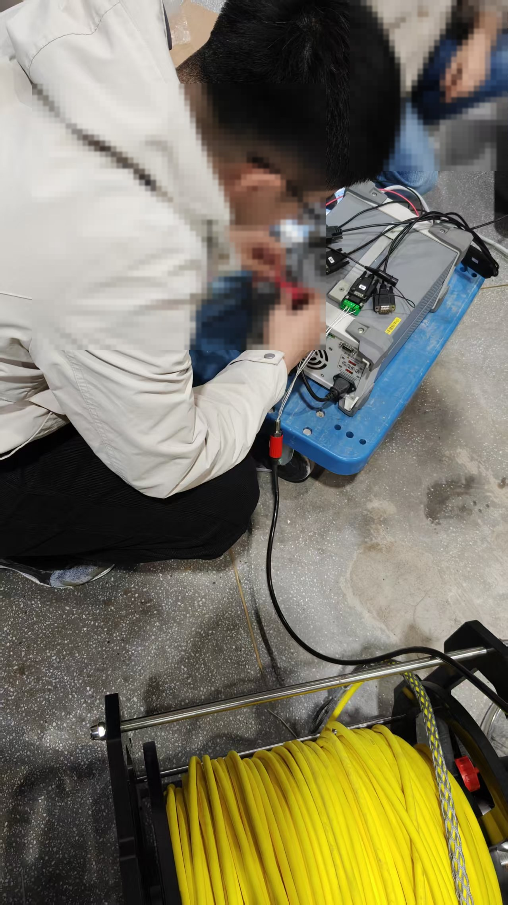
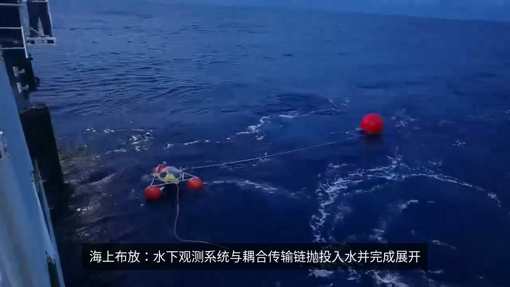
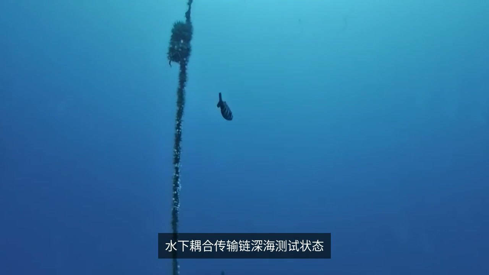

# 水下多参数剖面监测系统

> 比赛项目 · 在研中 · 有限公开

面向水域剖面监测场景的嵌入式系统集成项目。系统围绕传感器数据采集、控制器协同、数据通信与移动平台联调展开，当前仍处于比赛和整机验证阶段。

## 本人职责

- 参与总体方案设计，拆分任务并协调阶段进度。
- 负责传感器采集硬件电路的设计与调试。
- 参与控制器、传感节点、数据通信和移动平台的系统联调。
- 整理阶段问题，配合完成整机验证与迭代。

## 公开技术方向

- STM32 嵌入式控制
- 多传感器数据采集
- ADC 信号调理与采样
- 硬件调试与故障定位
- 数据通信与系统集成

## 当前状态

项目与比赛尚未结束，本仓库仅用于展示项目背景、本人职责和公开技术方向，不代表项目已经结题，也不声明尚未公布的比赛结果。

## 现场证据（有限公开）

以下素材来自阶段性测试记录，用于说明本人确实参与过设备布放、传感链检查、现场联调和数据链路排查。照片中的人脸已做脱敏处理，日志和屏幕中的关键字段也已遮盖；视频仅保留两张不含人脸的过程截帧。

| 场景 | 记录 |
| --- | --- |
| 水池布放 |  |
| 水下剖面 |  |
| 耦合链体 |  |
| 现场联调 |  |
| 数据链路 |  |
| 硬件调试 |  |
| 视频截帧 |   |

这些图片只作为经历证明，不替代项目技术文档，也不代表公开全部实现细节。

## 公开边界

为遵守比赛和团队保密要求，本仓库不提供以下内容：

- 比赛论文、说明书与申报材料
- 源代码、原理图和 PCB 资料
- 通信协议、控制流程与关键实现细节
- 性能指标、测试数据与标定记录
- 机械结构、尺寸和加工资料
- 未经脱敏的设备信息、人员信息或现场原图；仓库只保留经过筛选和脱敏的证据素材

项目结束并完成团队授权后，再评估是否补充可公开内容。

## 展示入口

[Z Lab 嵌入式项目页](https://zhangjik.bbroot.com/?v=project43-fixed#projects)
